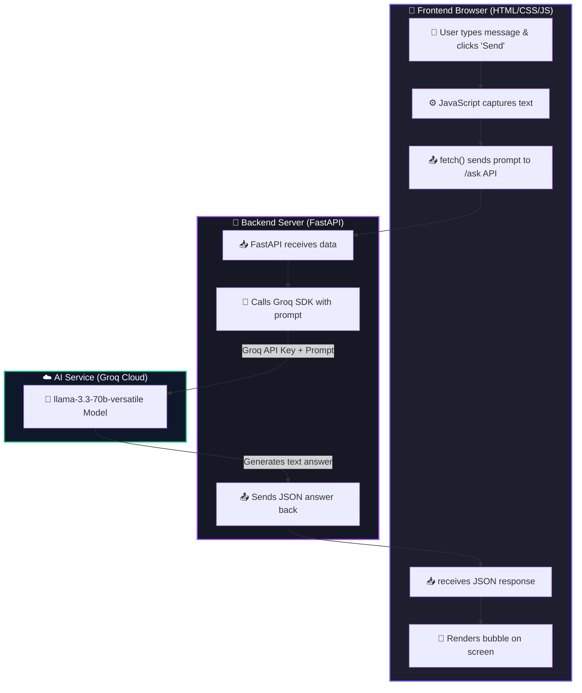

# Nobeth Demo AI Chatbot

Welcome to the **Nobeth Demo AI Chatbot**! This project is a simple, end-to-end web application designed specifically for students with **zero coding knowledge**. It shows how a web browser, a backend server, and an Artificial Intelligence (AI) model connect to build a real-world chatbot.

---

## ⚡ End-to-End Workflow

Here is how the entire system connects and works when you send a message:



---

## 🐍 Backend Functions & Parameters (`app.py`)

The backend is built using **FastAPI** (Python). Think of the backend like a **restaurant waiter**—it takes your order (prompt), runs to the kitchen (Groq AI), and brings back your food (AI response).

### Key Functions & Routes

| Route / Code | Function Name | Input Parameters | What it returns (Output) | What it does (Simple Explanation) |
| :--- | :--- | :--- | :--- | :--- |
| **`GET /`** | `get_home_page` | `request: Request` <br>*(The incoming web visit request)* | The HTML page (`index.html`) | **The Welcome Screen**: When you visit `http://127.0.0.1:8080`, this function serves the visual webpage to your browser. |
| **`POST /ask`** | `ask_ai` | `request_data: AskRequest` <br>*(A JSON object containing the user's prompt)* | A JSON object:<br>`{"response": "AI reply text"}` | **The Brain Connector**: Receives your question, forwards it to Groq's AI, gets the response, and sends it back to the browser. |

---

### 🤖 The Groq AI SDK Call (Under the Hood)
Inside the `ask_ai` function, we communicate with the AI using this code:
```python
completion = groq_client.chat.completions.create(
    model="llama-3.3-70b-versatile",
    messages=[
        {"role": "system", "content": "You are a helpful assistant."},
        {"role": "user", "content": user_prompt}
    ]
)
```

#### What do these parameters mean?
* **`model="llama-3.3-70b-versatile"`**: The specific AI model we are using. It is a highly intelligent text-based AI.
* **`messages`**: A list of instructions for the AI:
  * **`system`**: Sets the AI's personality/behavior (e.g., "be concise and friendly").
  * **`user`**: The actual question the student typed in the browser.
* **`completion.choices[0].message.content`**: How we extract the raw text answer generated by the AI from the data package returned by Groq.

---

## 🎨 Frontend JavaScript Functions (`index.html`)

The frontend contains **JavaScript** to handle interactions. JavaScript makes our page dynamic and alive, responding to clicks and keystrokes instantly.

### JavaScript Functions

| Function Name | Parameters | What it does (Simple Explanation) |
| :--- | :--- | :--- |
| **`appendMessage(text, sender)`** | `text` *(the message string)*<br>`sender` *(either 'user' or 'ai')* | **Draws a Bubble**: Dynamically creates a new HTML chat bubble on the screen. If `sender` is `'user'`, it colors it Purple/Indigo and aligns it to the right. If `'ai'`, it colors it Slate Grey and aligns it to the left. It also auto-scrolls the chat window to the bottom. |
| **`appendLoader()`** | *None* | **Shows Loading**: Appends a temporary bubble containing three pulsing dots to let the user know the AI is "thinking". Returns a reference to the element so we can delete it later. |
| **`sendMessage()`** | *None* | **The Orchestrator**: <br>1. Reads the text box.<br>2. Adds the user's chat bubble to the screen.<br>3. Clears the text box & disables typing.<br>4. Shows the pulsing dots loader.<br>5. Uses `fetch()` to call the backend `/ask`. <br>6. Deletes the loader and displays the AI's final answer. |

---

### 📥 The Fetch API Request
Inside the `sendMessage` function, JavaScript communicates with the backend using this call:
```javascript
const response = await fetch("/ask", {
    method: "POST",
    headers: { "Content-Type": "application/json" },
    body: JSON.stringify({ prompt: promptText })
});
```
* **`fetch("/ask")`**: Sends an HTTP request to our backend server's `/ask` URL endpoint.
* **`method: "POST"`**: Indicates we are *sending* data (the prompt) to the server rather than just asking for data.
* **`headers`**: Tells the server we are sending data formatted in JSON.
* **`body`**: Converts our JavaScript object `{ prompt: promptText }` into a text string so it can travel across the network.

---

## 📖 Glossary of Terms (With Real-World Analogies)

> [!TIP]
> Use these analogies to understand the concepts if you are completely new to programming!

* **🌐 Frontend**: **The Restaurant Dining Room**. It is the beautiful, decorated environment where customers sit, read the menu (UI), and enjoy the experience.
* **⚙️ Backend**: **The Restaurant Kitchen**. It is hidden behind doors. The chef prepares meals, manages ingredients (data), and handles the heavy lifting.
* **🌉 API (Application Programming Interface)**: **The Waiter**. The waiter takes your order from the dining room (frontend), carries it to the kitchen (backend), and returns with your food (response).
* **📦 JSON**: **The Serving Tray**. A standardized tray used to carry data back and forth across the restaurant in a clean, organized manner.
* **🛠️ SDK (Software Development Kit)**: **A Pre-packaged Recipe Box**. It provides pre-made ingredients and tools so developers don't have to write complex connection code from scratch.
* **🧠 LLM (Large Language Model)**: **The Smart Chef**. A computer model trained on millions of pages of text to understand human prompts and write human-like replies.
* **🔒 Environment Variables (`.env`)**: **The Restaurant Safe**. A secure place to lock away secret recipes and keys (like API Keys) so they aren't left lying around in the open.
