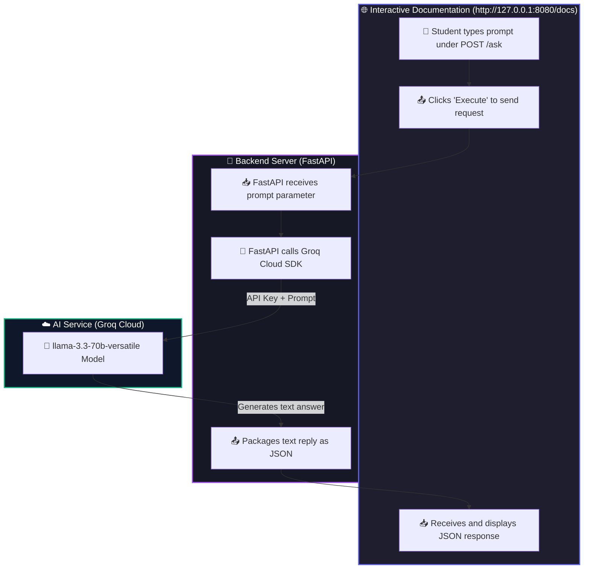

# 🤖 Minimal AI Chatbot API

Welcome to the **Minimal AI Chatbot API**! This project is a simple, end-to-end backend web application designed specifically for students with **zero coding knowledge**.

The goal of this project is to show you how a web server (backend) accepts input data, communicates with an Artificial Intelligence (AI) service, and returns the result as a JSON response.

---

## 📂 Project Structure & File Purposes

Here are the files in this project and what they do:

```text
Nobeth-AI-chatbot-demo/
│
├── .env                  # 🔒 Secret file: Stores your private Groq API key.
├── .gitignore            # 🙈 Git controller: Tells Git to ignore .env and virtual environments.
├── requirements.txt      # 📦 Package list: Lists the Python libraries our project needs.
├── app.py                # 🐍 Application core: The main backend code (under 25 lines!).
└── README.md             # 📖 This guide: Explains how the project works and how to run it.
```

---

## ⚡ End-to-End Workflow

Here is how the API works under the hood when you send a request:



### Step-by-Step Breakdown:
1. **Student Action**: You open the interactive docs page (`/docs`) in your browser, type a prompt (e.g., `"Explain photosynthesis"`), and click **Execute**.
2. **The Request**: Your browser sends a `POST` request to the server with the prompt text parameter.
3. **The Server**: FastAPI receives the prompt parameter and sends it to Groq's super-fast AI servers using the **Groq Python SDK**.
4. **The AI**: Groq's AI model (`llama-3.3-70b-versatile`) processes the prompt and generates a text response.
5. **The Response**: FastAPI gets the response, packs it into a JSON object `{"response": "..."}`, and sends it back to your browser.

---

## 🔌 API Endpoints & Workflow Structure

For a quick reference on how our API handles data, review the clean structure below:

### 1. API Endpoints
| Method | Endpoint | Purpose | Description |
| :--- | :--- | :--- | :--- |
| **`GET`** | **`/`** | **User Redirect** | Automatically redirects any visitor from the root URL to the interactive Swagger UI (`/docs`) page. |
| **`POST`** | **`/ask`** | **AI Inference Handler** | Accepts a user prompt parameter, calls the Groq Cloud AI SDK, and returns the AI's response in JSON. |

### 2. Payload Structure
* **POST `/ask` Parameter**:
  - `prompt` (string text)
* **POST `/ask` Response JSON**:
  ```json
  {
    "response": "Photosynthesis is the process by which plants convert sunlight into energy..."
  }
  ```

### 3. Step-by-Step System Workflow
```text
[ Browser / Client ] 
       │ 
       ├─ (1) Sends POST request to '/ask?prompt=user+question'
       │
[ FastAPI Server (app.py) ]
       │
       ├─ (2) Receives the prompt string parameter
       ├─ (3) Contacts Groq SDK with Model "llama-3.3-70b-versatile" + API Key
       │
[ Groq Cloud AI ]
       │
       ├─ (4) Generates response text using Llama-3.3 model
       │
[ FastAPI Server (app.py) ]
       │
       ├─ (5) Extracts raw response text from Groq response
       ├─ (6) Packages response into {"response": "AI text"}
       │
[ Browser / Client ]
       └─ (7) Displays the JSON response to the user
```

---

## 🚀 Setup Guide from Scratch (For New Users)

Follow these steps to set up and run this project on any new computer:

### Step 1: Download (Pull) the Repository
Open your terminal (PowerShell or Command Prompt) and run:
```bash
git clone https://github.com/sankaran-s2001/Nobeth-AI-chatbot-demo.git
cd Nobeth-AI-chatbot-demo
```

### Step 2: Create a New Virtual Environment
A virtual environment keeps our project libraries separated from other projects on your computer.
```bash
python -m venv venv
```

### Step 3: Activate the Virtual Environment
Activate it based on your operating system:
* **Windows (PowerShell)**:
  ```powershell
  .\venv\Scripts\Activate.ps1
  ```
* **Windows (Command Prompt)**:
  ```cmd
  venv\Scripts\activate.bat
  ```
* **macOS / Linux**:
  ```bash
  source venv/bin/activate
  ```

### Step 4: Install the Required Packages
Install all libraries listed in the `requirements.txt` file:
```bash
pip install -r requirements.txt
```

### Step 5: Configure the API Key
1. Create a new file named `.env` in the root of the project directory.
2. Open the `.env` file in your text editor and add the following line, replacing the placeholder with your actual Groq API key:
   ```text
   GROQ_API_KEY=your_groq_api_key_here
   ```

### Step 6: Start the Server
```bash
uvicorn app:app --reload --port 8080
```

### Step 7: Open the Interactive UI
Open your browser and navigate to:
👉 **[http://127.0.0.1:8080/](http://127.0.0.1:8080/)** (This automatically redirects you to the `/docs` UI page!)

---

## 📜 Code Reference Guide (Functions & Parameters)

Here is a breakdown of the code functions inside `app.py`:

| Route / Endpoint | Function Name | Input Parameters | What it returns (Output) | What it does (Simple Explanation) |
| :--- | :--- | :--- | :--- | :--- |
| **`GET /`** | `welcome` | *None* | A redirect to `/docs` | **The Welcome Route**: Automatically redirects the browser to the `/docs` page so students see the interactive UI immediately. |
| **`POST /ask`** | `ask_ai` | `prompt: str` <br>*(The question text)* | A JSON object:<br>`{"response": "AI text answer"}` | **The Chat Handler**: Receives your question, forwards it to Groq's AI, gets the response, and sends it back to the browser. |

---

### 🤖 The Groq AI SDK Call
Inside the `ask_ai` function, we ask Groq to generate a response using this code:
```python
completion = client.chat.completions.create(
    model="llama-3.3-70b-versatile",
    messages=[{"role": "user", "content": prompt}]
)
```

#### What do these parameters mean?
* **`model="llama-3.3-70b-versatile"`**: The specific AI model we want to run.
* **`messages`**: Instructions for the AI:
  * **`role: "user"`**: Specifies that the prompt is coming from the user.
  * **`content: prompt`**: The actual question the student typed in the input box.
* **`completion.choices[0].message.content`**: Extracts the generated text response out of the larger API response object.

---

## 📖 Glossary of Terms (With Real-World Analogies)

> [!TIP]
> Use these analogies to understand the concepts if you are completely new to programming!

* **⚙️ Backend**: **The Restaurant Kitchen**. It is hidden behind doors. The chef prepares meals, manages ingredients (data), and handles the heavy lifting.
* **🌉 API (Application Programming Interface)**: **The Waiter**. The waiter takes your order from the table, carries it to the kitchen (backend), and returns with your food (response).
* **📥 Endpoint (`/ask`)**: **A Specific Item on the Menu**. It is a specific web address that accepts inputs to perform a specific action (like getting an AI response).
* **📦 JSON**: **The Serving Tray**. A standardized format used to carry structured data back and forth over the internet.
* **🛠️ SDK (Software Development Kit)**: **A Pre-packaged Recipe Box**. It provides pre-made ingredients and tools so developers don't have to write complex connection code from scratch.
* **🧠 LLM (Large Language Model)**: **The Smart Chef**. A computer model trained on millions of pages of text to understand human prompts and write human-like replies.
* **🔒 Environment Variables (`.env`)**: **The Restaurant Safe**. A secure place to lock away secret API keys so they aren't left lying around in the open.
